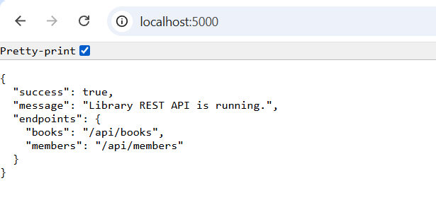
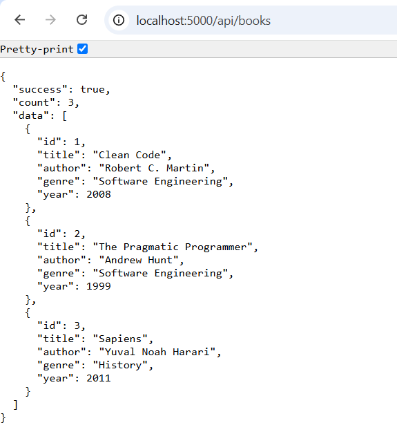
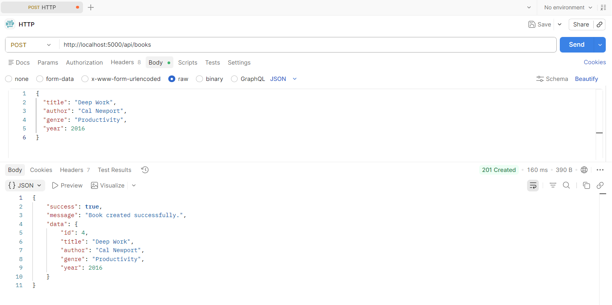
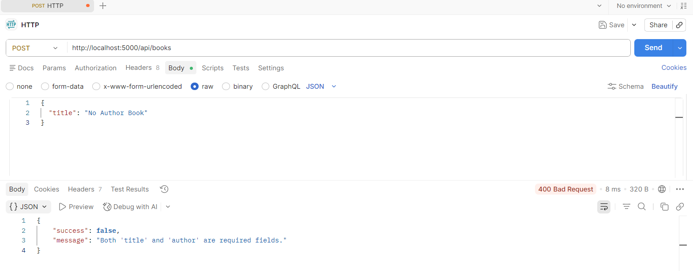

# Library REST API

A stateless REST API built with Node.js and Express, demonstrating core backend fundamentals: routing, HTTP methods, structured JSON responses, input validation, and centralized error handling.

Built as **Project 1: REST API Fundamentals** — DecodeLabs Industrial Training Kit.

## Overview

This API manages a small library system with two resources — **books** and **members** — using in-memory data storage. It focuses purely on request/response logic, not persistence, since that's the scope of this milestone.

## Features

- GET and POST routes for both resources
- Routes split into separate modules, not a single file
- Consistent JSON response format (`success`, `data`, `message`)
- Input validation with correct HTTP status codes (`400`, `404`, `409`)
- Centralized error handling instead of default server error pages
- Request logging middleware


## Tech Stack

- Node.js
- Express.js

## Getting Started

**Prerequisites:** Node.js v16 or higher

```bash
git clone https://github.com/<SaniaSaeed2>/library-rest-api.git
cd library-rest-api
npm install
node index.js
```

Server runs at `http://localhost:5000`

## API Endpoints

### General

| Method | Route     | Description                      |
|--------|-----------|-----------------------------------|
| GET    | `/`       | API status and available routes  |


### Books

| Method | Route                        | Description                  |
|--------|-------------------------------|-------------------------------|
| GET    | `/api/books`                  | Get all books                 |
| GET    | `/api/books?genre=History`    | Filter books by genre         |
| GET    | `/api/books/:id`               | Get a single book by ID        |
| POST   | `/api/books`                   | Create a new book              |

**POST /api/books — request body:**
```json
{
  "title": "Deep Work",
  "author": "Cal Newport",
  "genre": "Productivity",
  "year": 2016
}
```

### Members

| Method | Route                | Description               |
|--------|------------------------|-----------------------------|
| GET    | `/api/members`          | Get all members             |
| GET    | `/api/members/:id`      | Get a single member by ID    |
| POST   | `/api/members`          | Register a new member        |

**POST /api/members — request body:**
```json
{
  "name": "Sania Saeed",
  "email": "saniasaeed@example.com"
}
```

## Screenshots

**Root endpoint**



**GET all books**



**POST — successful creation**



**POST — validation error**



## Error Handling

All errors return consistent JSON instead of default HTML error pages:

```json
{
  "success": false,
  "message": "Both 'title' and 'author' are required fields."
}
```

| Status | Meaning                                  |
|--------|--------------------------------------------|
| 400    | Invalid or missing input                    |
| 404    | Resource or route not found                 |
| 409    | Conflict (e.g. duplicate email)              |
| 500    | Unexpected server error                      |

## Design Notes

- Data is stored in-memory by design — persistence is a later milestone, not this one.
- Routes are modularized (`routes/books.js`, `routes/members.js`) to reflect real project structure rather than one large file.
- Validation happens before any data mutation, so bad input never reaches the data layer.
